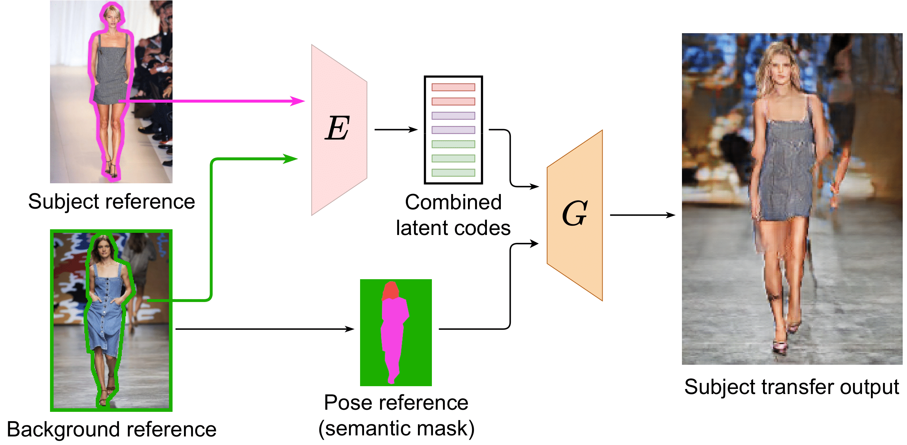

# SCAM! Transferring humans between images with Semantic Cross Attention Modulation

Official PyTorch implementation of "SCAM! Transferring humans between images with Semantic Cross Attention Modulation", ECCV 2022.

<a href="https://arxiv.org/abs/2210.04883">Arxiv</a> | <a href="https://imagine.enpc.fr/~dufourn/scam">Website</a>


<p align="center">

</p>


## Bibtex

If you happen to find this code or method useful in your research please cite this paper with

```
@article{dufour2022scam,
  title={SCAM! Transferring humans between images with Semantic Cross Attention Modulation},
  author={Nicolas Dufour, David Picard, Vicky Kalogeiton},
  booktitle={Proceedings of the European Conference on Computer Vision (ECCV)},
  year={2022}
}
```

## Installation guide
To install this repo follow the following step:

1. Install Anaconda or MiniConda
2. Run `conda create -n scam python=3.9.12` 
3. Activate scam:  `conda activate scam`
4. Install pytorch 1.12 and torchvision 0.13 that match your device:
    - For cpu:
    ```bash
    conda install pytorch==1.12.0 torchvision==0.13.0 torchaudio==0.12.0 cpuonly -c pytorch
    ```
    - For cuda 11.6:
    ```bash
    conda install pytorch==1.12.0 torchvision==0.13.0 cudatoolkit=11.6 -c pytorch -c conda-forge
    ```
5. Install dependencies:
```
conda env update --file environment.yml
```

## Prepare the data

### Download CelebAHQ

<a href="https://drive.google.com/file/d/1TKhN9kDvJEcpbIarwsd1_fsTR2vGx6LC/view?usp=sharing">Download link</a>: Dataset provided and processed by <a href=https://github.com/ZPdesu/SEAN>SEAN</a> authors.
Unzip in the datasets folder.
Then run:

```bash
python preprocess_fid_features.py dataset=CelebAHQ
```
to run on GPU run:

```bash
python preprocess_fid_features.py dataset=CelebAHQ compnode=single-gpu
```

## Add a new dataset
If you want to add a new dataset you need to follow the same directory structure as the other datasets:

2 folders: train and test. 
Each folders contains 4 sub-folders: images, labels, vis and stats.
- images: contains the rgb images. can be jpg or png.
- labels: the segmentation labels. needs to be png where each pixels takes value between 0 and num_labels.
- vis: rgb visualization of the labels
- stats: Inception statistics of the train dataset. To do so, initialize a dataloader with the train dataloader 

Create a config file for the dataset in configs/dataset (the name of the dataset should be the name of the config file)

and run:

```bash
python preprocess_fid_features.py dataset=dataset_name compnode=(cpu or single-gpu)
```

## Run SCAM
Our code needs to be logged in wandb. Make sure to be logged in to wandb before starting. 
To run our code you just need to do:

```bash
python train.py
```

By default the code will be runned on cpu. If you want to run it on gpu you can do:

```bash
python train.py compnode=single-gpu
```

Other compute configs exists in `configs/compnode`. If none suit your needs you can easily create one thanks to the modularity of hydra.

In this paper, the main compute config we use is the 4 gpus (NVIDIA V100 32g with a total batch size of 32, 8 per GPUs) config called `1-node-cluster`.

By default, our method scam will be runned. If you want to try one of the baselines we compare to, you can run

```bash
python train.py model=sean
```

We include implementations for SEAN, SPADE, INADE, CLADE and GroupDNET.

To swap datasets, you can do:

```bash
python train.py dataset=CelebAHQ
```

we support 3 datasets, `CelebAHQ`, `idesigner` and `ADE20K`.

If you want to run different experiments, make sure to change `experiment_name_comp` or `experiment_name` when running. Otherwise or code will restart the training from the checkpointed weights for the experiment with the same name.

## Pretrained models
Coming soon